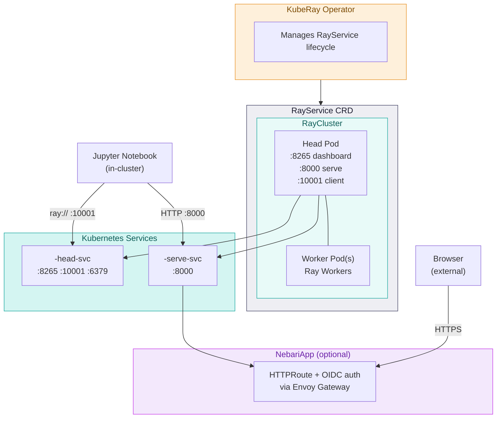

# Nebari Ray Serve Software Pack

A [Nebari Software Pack](https://github.com/nebari-dev/nebari-software-pack-template) that deploys [Ray Serve](https://docs.ray.io/en/latest/serve/index.html) on Kubernetes using the [RayService CRD](https://docs.ray.io/en/latest/serve/production-guide/kubernetes.html), with optional routing, TLS, and OIDC authentication via the [nebari-operator](https://github.com/nebari-dev/nebari-operator).

## Overview

This pack deploys a production-ready Ray Serve instance using the RayService CRD (the [recommended approach](https://docs.ray.io/en/latest/serve/production-guide/kubernetes.html) for running Ray Serve on Kubernetes).

**What gets deployed:**

- KubeRay operator (manages Ray cluster and Serve lifecycle)
- RayService (Ray cluster + Serve proxy, pre-initialized with `host: 0.0.0.0`)
- Stable Kubernetes Services for the dashboard and serve endpoint
- NebariApp resources for external access via Envoy Gateway (optional)

**Two access patterns:**

| Access from | Path | Auth required? |
|-------------|------|----------------|
| Jupyter notebook (in-cluster) | Direct to K8s service | No |
| Browser / external client | Envoy Gateway via NebariApp | Yes (if enabled) |

## Prerequisites

- [kubectl](https://kubernetes.io/docs/tasks/tools/)
- [Helm 3](https://helm.sh/docs/intro/install/)
- A Kubernetes cluster (or [kind](https://kind.sigs.k8s.io/) for local dev)

## Quick Start

### Standalone (no Nebari)

```bash
cd chart
helm dependency update .
helm install rayserve . --create-namespace -n rayserve --wait --timeout 5m
```

Access via port-forward:

```bash
# Ray Dashboard
kubectl port-forward svc/rayserve-nebari-rayserve-head-svc 8265:8265 -n rayserve

# Ray Serve endpoint
kubectl port-forward svc/rayserve-nebari-rayserve-serve-svc 8000:8000 -n rayserve
```

### On a Nebari cluster (via ArgoCD)

Add this to your GitOps repo as `apps/rayserve-pack.yaml`:

```yaml
apiVersion: argoproj.io/v1alpha1
kind: Application
metadata:
  name: rayserve-pack
  namespace: argocd
  annotations:
    argocd.argoproj.io/sync-wave: "7"
  finalizers:
    - resources-finalizer.argocd.argoproj.io
spec:
  project: default
  source:
    repoURL: https://github.com/nebari-dev/nebari-rayserve-pack.git
    targetRevision: main
    path: chart
    helm:
      releaseName: rayserve
      values: |
        nebariapp:
          enabled: true
          serve:
            enabled: false  # Keep serve endpoint internal-only
          dashboard:
            enabled: true
            hostname: ray-dashboard.example.com
          auth:
            enabled: true
            provider: keycloak
            provisionClient: true
            redirectURI: /oauth2/callback
  destination:
    server: https://kubernetes.default.svc
    namespace: rayserve
  syncPolicy:
    automated:
      prune: true
      selfHeal: true
    managedNamespaceMetadata:
      labels:
        nebari.dev/managed: "true"
    syncOptions:
      - CreateNamespace=true
      - ServerSideApply=true
      - SkipDryRunOnMissingResource=true
      - RespectIgnoreDifferences=true
    retry:
      limit: 5
      backoff:
        duration: 5s
        factor: 2
        maxDuration: 3m
  # The KubeRay controller modifies RayService and Service resources at
  # runtime (adding selectors, status fields, etc.), causing a permanent
  # OutOfSync state without these ignore rules.
  ignoreDifferences:
    - group: ""
      kind: Service
      jsonPointers:
        - /spec/selector
        - /spec/clusterIP
        - /spec/clusterIPs
    - group: ray.io
      kind: RayService
      jsonPointers:
        - /spec/rayClusterConfig
        - /status
```

**Important:**
- `managedNamespaceMetadata` with `nebari.dev/managed: "true"` is required for the nebari-operator to manage NebariApp resources
- `redirectURI` must be `/oauth2/callback` (Envoy Gateway rejects `/`)
- Set `serve.enabled: false` to keep the serve endpoint internal-only (recommended — notebooks access it via cluster DNS)

## Connecting from Jupyter

From a notebook running in the same cluster (e.g., via the [nebari-data-science-pack](https://github.com/nebari-dev/nebari-data-science-pack)):

```python
import ray
from ray import serve
import requests

# Connect to the Ray cluster
ray.init("ray://rayserve-nebari-rayserve-head-svc.rayserve.svc.cluster.local:10001")

# Deploy a model
@serve.deployment
class Hello:
    async def __call__(self, request):
        return "Hello from Ray Serve!"

serve.run(Hello.bind(), name="hello", route_prefix="/hello")

# Run inference
resp = requests.get("http://rayserve-nebari-rayserve-serve-svc.rayserve.svc.cluster.local:8000/hello")
print(resp.text)
# Hello from Ray Serve!
```

No manual Serve initialization is needed — the RayService CRD starts the Serve proxy with `host: 0.0.0.0` automatically.

**Note:** The Ray and Python versions in your Jupyter environment must match the Ray cluster. This chart deploys Ray 2.43.0 with Python 3.9 by default. If using [Nebi](https://github.com/nebari-dev/nebari-nebi-pack) for environment management, create a workspace with:

```toml
[workspace]
name = "ray-serve"
channels = ["conda-forge"]
platforms = ["linux-64"]

[dependencies]
python = "3.9.*"
ray-serve = "2.43.*"
ipykernel = ">=6.0"
```

## Deploying Models (Production)

For production, bake your model code into a custom Docker image and declare applications in `values.yaml`:

```yaml
image:
  repository: your-registry/your-ray-image
  tag: "2.43.0-custom"

serveApplications:
  - name: my-model
    route_prefix: /predict
    import_path: myapp.model:app
    deployments:
      - name: MyModel
        num_replicas: 2
```

The RayService controller handles deployment, health monitoring, and zero-downtime upgrades automatically.

## Chart Configuration

Key values in `chart/values.yaml`:

### Nebari Integration

| Value | Default | Description |
|-------|---------|-------------|
| `nebariapp.enabled` | `false` | Create NebariApp resources for routing/TLS/auth |
| `nebariapp.serve.enabled` | `true` | Expose the serve endpoint externally (set `false` to keep internal-only) |
| `nebariapp.hostname` | - | Hostname for the Ray Serve endpoint (required when serve.enabled) |
| `nebariapp.dashboard.enabled` | `true` | Create a separate NebariApp for the Ray Dashboard |
| `nebariapp.dashboard.hostname` | - | Hostname for the Ray Dashboard (required when dashboard enabled) |
| `nebariapp.auth.enabled` | `false` | Enable OIDC authentication via Keycloak |
| `nebariapp.auth.redirectURI` | `/oauth2/callback` | OAuth callback path (Envoy Gateway rejects `/`) |
| `nebariapp.gateway` | `public` | Gateway to use (`public` or `internal`) |

### Ray Cluster

| Value | Default | Description |
|-------|---------|-------------|
| `image.repository` | `rayproject/ray` | Ray container image |
| `image.tag` | `2.43.0` | Ray version |
| `head.resources.requests.cpu` | `1` | Head node CPU request |
| `head.resources.requests.memory` | `2Gi` | Head node memory request |
| `head.runtimeClassName` | - | Runtime class for head pod (e.g., `nvidia` for GPU) |
| `worker.replicas` | `1` | Number of worker nodes |
| `worker.minReplicas` | `1` | Min workers (for autoscaling) |
| `worker.maxReplicas` | `1` | Max workers (for autoscaling) |
| `worker.resources.requests.cpu` | `1` | Worker CPU request |
| `worker.resources.requests.memory` | `2Gi` | Worker memory request |
| `worker.runtimeClassName` | - | Runtime class for worker pods (e.g., `nvidia` for GPU) |

### Serve Applications

| Value | Default | Description |
|-------|---------|-------------|
| `serveApplications` | `[]` | Declarative Serve applications (see [Ray Serve config](https://docs.ray.io/en/latest/serve/production-guide/config.html)) |

### Organization CA Bundle Injection

For deployments behind a TLS-inspecting proxy (Netskope, Zscaler, BlueCoat, internal corporate CAs, etc.), point `orgCABundle.configMapName` at a ConfigMap containing your organization's root CA. The chart adds an initContainer that builds a combined CA bundle (system trust + org CA), mounts it into the head and worker pods, and sets `SSL_CERT_FILE` / `REQUESTS_CA_BUNDLE` / `CURL_CA_BUNDLE` so any TLS client honoring those env vars (requests, urllib3, curl, git, pip, `torch.hub`, etc.) trusts the proxy's re-signed certs.

| Value | Default | Description |
|-------|---------|-------------|
| `orgCABundle.configMapName` | `""` | Name of a ConfigMap with key `ca.crt` containing the org CA (PEM). Empty disables injection — no behavior change. |
| `orgCABundle.initImage` | `alpine:3.20` | Image used by the bundle-building initContainer. Only needs `sh` + `cat`. |

```yaml
# Create the ConfigMap out-of-band (gitops, kubectl, etc.):
apiVersion: v1
kind: ConfigMap
metadata:
  name: org-ca-bundle
data:
  ca.crt: |
    -----BEGIN CERTIFICATE-----
    ...your org CA...
    -----END CERTIFICATE-----
---
# Then point the chart at it:
orgCABundle:
  configMapName: org-ca-bundle
```

> **Why ConfigMap rather than Secret?** A CA certificate is public material by design — the PKI trust model relies on root CAs being widely distributed. Kubernetes itself uses a ConfigMap for the cluster's own CA distribution (`kube-root-ca.crt`, auto-projected into every namespace), and cert-manager's trust-manager subproject does the same. Use a ConfigMap here; reserve Secret for things that actually need confidentiality (private keys, OAuth client secrets, etc.).

**Coverage caveat — httpx default `verify=True`:** httpx hardcodes its SSL context to `cafile=certifi.where()`, which means it **ignores** `SSL_CERT_FILE`. Application code making httpx calls that need to traverse a TLS-inspecting proxy must construct an explicit context:

```python
import ssl, httpx
client = httpx.Client(verify=ssl.create_default_context())
# or per-call: httpx.get(url, verify=ssl.create_default_context())
```

`ssl.create_default_context()` with no `cafile=` honors `SSL_CERT_FILE` / `SSL_CERT_DIR` per the standard OpenSSL convention, so it picks up the bundle this chart injected. Other Python HTTP clients (`requests`, `urllib3`, stdlib `urllib`) and most non-Python TLS tooling honor the env vars automatically.

## Architecture



## Repository Structure

```
nebari-rayserve-pack/
  chart/
    Chart.yaml                 # Depends on kuberay-operator
    values.yaml                # RayService + NebariApp configuration
    templates/
      _helpers.tpl             # Name, label, and service name helpers
      rayservice.yaml          # RayService CRD
      services.yaml            # Stable head and serve K8s Services
      nebariapp.yaml           # NebariApp CRDs (conditional)
      NOTES.txt                # Post-install usage instructions
  dev/
    Makefile                   # Local dev with full Nebari stack on kind
```

## Troubleshooting

### Ray Dashboard returns 500 via NebariApp

The NebariApp may be pointing at a service that doesn't exist. Check the actual service name:

```bash
kubectl get svc -n rayserve
```

The stable services are `<release>-nebari-rayserve-head-svc` and `<release>-nebari-rayserve-serve-svc`.

### Version mismatch connecting from Jupyter

The Ray and Python versions in your notebook environment must match the cluster:

```bash
kubectl exec -n rayserve $(kubectl get pod -n rayserve -l ray.io/node-type=head -o name) -- ray --version
kubectl exec -n rayserve $(kubectl get pod -n rayserve -l ray.io/node-type=head -o name) -- python --version
```

### NebariApp not reaching Ready

Check that the namespace has the managed label:

```bash
kubectl get namespace rayserve --show-labels | grep nebari.dev/managed
```

If missing, add it (or use `managedNamespaceMetadata` in the ArgoCD app):

```bash
kubectl label namespace rayserve nebari.dev/managed=true
```

### JupyterHub notebooks can't reach Ray

The default JupyterHub singleuser network policy blocks egress to private IPs. Add this to your data science pack values:

```yaml
jupyterhub:
  singleuser:
    networkPolicy:
      egressAllowRules:
        privateIPs: true
```
