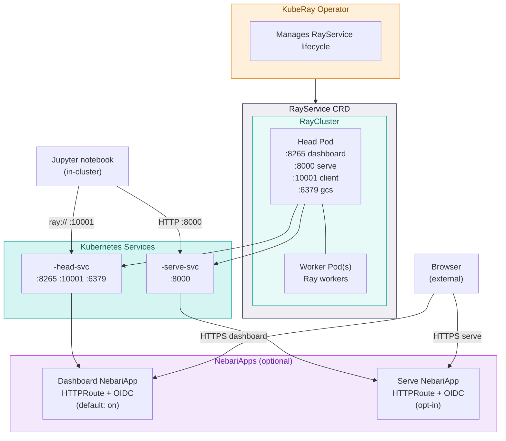

# Architecture

The pack is a Helm chart that lays down:

- The **KubeRay operator** — a Kubernetes controller that watches
  `RayService` resources and reconciles them into running Ray clusters.
- A **RayService** custom resource — the declarative spec for *this*
  cluster: image, head pod, worker pool, Serve config.
- Stable **Kubernetes Services** for the dashboard and serve endpoint, so
  clients can reach the cluster via DNS even as pods restart.
- Optional **NebariApp** resources — when `nebariapp.enabled: true`, the
  nebari-operator picks these up and provisions Envoy Gateway HTTPRoutes,
  TLS certificates, and (if auth is enabled) a Keycloak client.

## Component diagram

## Resource walk-through

### KubeRay operator

A Kubernetes controller installed as a chart subchart
(`kuberay-operator.enabled: true`). It watches `RayService`, `RayCluster`,
and `RayJob` resources cluster-wide and reconciles each into the right set
of pods, services, and config maps.

The operator runs *outside* the Ray namespace by default. It's the only
component you'd ever uninstall and reinstall independently — the
RayService spec is stable across operator restarts.

### RayService CRD

A `ray.io/v1` custom resource managed by the operator. It encapsulates:

- A **RayCluster spec** — head and worker pod templates, image, resources,
  probes, autoscaling bounds.
- A **Serve config** (`serveConfigV2`) — the declarative list of Serve
  applications to run on the cluster. The chart leaves this empty by
  default; populated when `serveApplications` is set.
- **Upgrade strategy** — zero-downtime rolling upgrades when the spec
  changes (a new RayCluster spins up alongside the old one, takes over
  traffic, and the old one is torn down).

End users do not interact with the RayService directly. Operators see it
via `kubectl get rayservice -n rayserve`.

### Head and worker pods

The Ray cluster itself: one head pod (the Ray GCS + dashboard + Serve
controller + Serve HTTP proxy) and one or more worker pods. Connection
flow:

- Notebooks connect to **`headsvc:10001`** (Ray client protocol).
- Inference traffic hits **`servesvc:8000`** (HTTP).
- The dashboard UI is on **`headsvc:8265`** (HTTP).

The worker pods exist purely for compute parallelism — they don't receive
HTTP traffic directly. Worker autoscaling (when `minReplicas != maxReplicas`)
is driven by the Ray autoscaler, not Kubernetes HPA.

### Stable Kubernetes Services

The chart creates two Services explicitly so that:

- The dashboard URL stays stable across pod restarts.
- The Serve URL stays stable as the RayService controller does rolling
  upgrades (which create and destroy RayClusters behind the scenes).

Names follow the pattern `<release>-<chart>-head-svc` and
`<release>-<chart>-serve-svc`. With the default release name `rayserve`
and chart name `nebari-rayserve`, the in-cluster DNS names are:

- `rayserve-nebari-rayserve-head-svc.rayserve.svc.cluster.local`
- `rayserve-nebari-rayserve-serve-svc.rayserve.svc.cluster.local`

### NebariApp (optional)

When `nebariapp.enabled: true`, the chart creates one or two NebariApp
resources — one for the dashboard, one for the serve endpoint. The
[nebari-operator](https://github.com/nebari-dev/nebari-operator) watches
NebariApps in `nebari.dev/managed` namespaces and provisions:

- An Envoy Gateway `HTTPRoute` pointing at the stable Service.
- A TLS certificate via cert-manager.
- (If `auth.enabled`) A Keycloak client and an OIDC SecurityPolicy.

The nebari-operator handles the full lifecycle — when you change a
NebariApp's hostname, the routing and TLS get rebuilt without manual
intervention.

## What the operator mutates at runtime

When ArgoCD or Helm applies the chart, the spec it ships is *not* what
ends up in the cluster after the controllers reconcile. KubeRay
specifically:

- Adds selectors and status fields to the `Service` resources backing
  RayService.
- Mutates the `RayService` itself: updates `spec.rayClusterConfig` during
  upgrades and writes status conditions.

This is why the [ArgoCD example in Get started](../get-started/deploy)
ships an `ignoreDifferences` block. Without it, ArgoCD sits in a
permanent `OutOfSync` state because every reconcile loop re-applies the
chart's spec, the controller re-mutates, and the diff never closes.

## Where each setting takes effect

| Chart setting | Resource it changes | When it applies |
|---|---|---|
| `image.tag`, `head.*`, `worker.*` | `RayService.spec.rayClusterConfig` | Triggers a rolling RayCluster upgrade. |
| `serve.proxyLocation`, `serveApplications` | `RayService.spec.serveConfigV2` | Applied without restarting Ray pods; Serve controller rolls deployments. |
| `nebariapp.hostname`, `nebariapp.auth.*` | `NebariApp` CR | nebari-operator updates HTTPRoute / SecurityPolicy in place. |
| `worker.readinessProbe` | RayCluster pod template | Applies to new worker pods on next replica scale-up. |

## Further reading

- [Ray Serve architecture](https://docs.ray.io/en/latest/serve/architecture.html) — upstream explanation of proxies, controllers, replicas.
- [KubeRay RayService design](https://github.com/ray-project/kuberay/blob/master/docs/reference/api.md) — the CRD's full API.
- [nebari-operator](https://github.com/nebari-dev/nebari-operator) — the
  NebariApp CRD and the operator that backs it.
