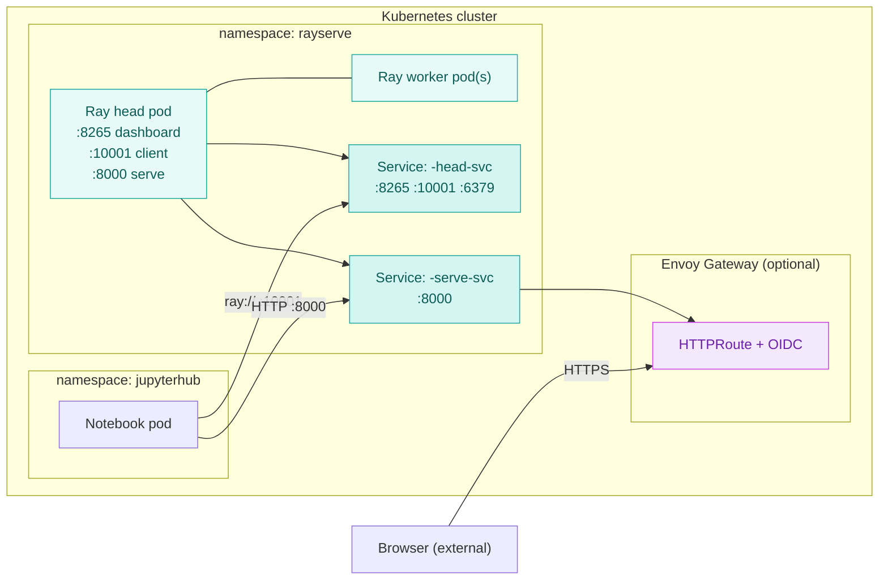

# Using Ray Serve

End-user guide for the Nebari Ray Serve pack. This walks through connecting to
the deployed Ray cluster from a Jupyter notebook, deploying a model, watching
it in the dashboard, and (optionally) exposing it outside the cluster.

The pack is administered separately — operators install the chart, configure
NebariApps, and pick the Ray image. This guide assumes that has already been
done and the cluster is healthy. For install and operations, see the pack
[README](https://github.com/nebari-dev/nebari-rayserve-pack/blob/main/README.md).

## What this pack is for

This pack deploys **Ray Serve** — Ray's framework for serving Python models
behind an HTTP endpoint. It is the right tool when you have a trained model
(or a chain of models) and you want to call it over HTTP from inside or
outside the cluster.

:::warning[Not a general Ray compute cluster]

Ray Data, Ray Tune, and Ray Train workloads will technically run on this
deployment, but the chart is tuned for serving: workers come up sized for
inference, the dashboard's landing page is wired for the Serve REST API,
and the chart ships a `serveConfigV2` even when no applications are
declared. For interactive parallel compute on Nebari, use the Dask gateway
from the data-science pack instead.

:::

The deployment is backed by the **RayService CRD** (a Kubernetes custom
resource that manages the Ray cluster's lifecycle) operated by KubeRay. You
do not start or stop the cluster from your notebook — it exists as a
long-lived resource in Kubernetes. You connect, deploy applications, and
disconnect; the cluster keeps running, and any applications you registered
with `serve.run(...)` keep serving until you call `serve.delete(...)` or the
cluster is restarted by an operator.

## How the pack is deployed

Two access patterns are supported. The recommended default is **internal-only** —
notebooks connect via cluster DNS, no auth needed, no external surface.
External (browser) access is opt-in and adds Envoy Gateway routing with OIDC
authentication via Keycloak.



Service names follow the pattern `<release>-<chart>-head-svc` and
`<release>-<chart>-serve-svc`. With the default release name `rayserve` and
chart name `nebari-rayserve`, the in-cluster DNS names are:

- `rayserve-nebari-rayserve-head-svc.rayserve.svc.cluster.local`
- `rayserve-nebari-rayserve-serve-svc.rayserve.svc.cluster.local`

These names are stable and exist as soon as the chart is installed —
they do **not** wait for a Serve application to be deployed.

## Step 1 — Prepare your notebook environment

:::warning[Version match required]

The Ray client uses a binary protocol that is sensitive to version skew.
Your notebook's Ray version **and** Python minor version must match the
cluster, or `ray.init(...)` will fail with an opaque error or hang. This
is the most common end-user failure mode.

:::

The default chart deploys **Ray 2.43.0** on **Python 3.9**. Confirm against
the running cluster (an operator can run this):

```bash
kubectl exec -n rayserve $(kubectl get pod -n rayserve -l ray.io/node-type=head -o name) -- ray --version
kubectl exec -n rayserve $(kubectl get pod -n rayserve -l ray.io/node-type=head -o name) -- python --version
```

If your Nebari deployment uses the [Nebi pack](https://github.com/nebari-dev/nebari-nebi-pack)
for workspace management, declare a workspace pinned to the cluster's versions:

```toml
[workspace]
name = "ray-serve"
channels = ["conda-forge"]
platforms = ["linux-64"]

[dependencies]
python = "3.9.*"
ray-serve = "2.43.*"
ipykernel = ">=6.0"
```

Without Nebi, install the same versions into your kernel directly:

```bash
pip install "ray[serve]==2.43.*"
```

:::note

Install `ray[serve]`, not bare `ray`. The Serve extras pull in the HTTP
and proxy components needed by `ray.serve`.

:::

## Step 2 — Connect from your notebook

Open a notebook on the same Nebari cluster (e.g. via the
[nebari-data-science-pack](https://github.com/nebari-dev/nebari-data-science-pack))
and connect to the Ray head via its in-cluster service:

```python
import ray

ray.init("ray://rayserve-nebari-rayserve-head-svc.rayserve.svc.cluster.local:10001")
print(ray.cluster_resources())
```

A successful connect prints the cluster's CPU/memory/GPU totals. No manual
cluster startup is needed — the RayService CRD has already initialised the
head pod with Serve proxying enabled on `0.0.0.0:8000`.

If `ray.init` hangs or raises a version-mismatch error, jump to
[Troubleshooting](#troubleshooting) below.

**Why `ray://...:10001` and not `http://...:8265`?** Port 10001 is the Ray
client server (binary protocol used by `ray.init`). Port 8265 is the
dashboard's HTTP UI and REST API — useful for browsing the cluster but not
the right entry point for `ray.init`. Port 8000 is the Serve HTTP endpoint
where deployed models receive requests.

## Step 3 — Deploy a model

### Hello world

Define a Serve deployment, bind it, and run it. The `serve.run(...)` call
registers the application with the Serve controller running on the head pod.

```python
from ray import serve
import requests

@serve.deployment
class Hello:
    async def __call__(self, request):
        return "Hello from Ray Serve!"

serve.run(Hello.bind(), name="hello", route_prefix="/hello")

resp = requests.get(
    "http://rayserve-nebari-rayserve-serve-svc.rayserve.svc.cluster.local:8000/hello"
)
print(resp.text)
# Hello from Ray Serve!
```

The application is now live. Other notebooks (and other in-cluster services)
can hit the same URL. To remove the application (and all of its deployments):

```python
serve.delete("hello")
```

`serve.delete(name)` removes the application registered under `name` — not a
single `@serve.deployment` inside it. The Ray cluster itself keeps running.

### Real models

For real-world patterns — JSON request bodies, `num_replicas`, GPU-aware
`ray_actor_options`, request batching, and chained models — the upstream
[Ray Serve quickstart](https://docs.ray.io/en/latest/serve/getting_started.html)
and [model composition guide](https://docs.ray.io/en/latest/serve/model_composition.html)
apply unchanged on this pack. The only constraint is that your model's
dependencies must be installed in the Ray image (operator concern — see
[Step 5](#step-5--handing-off-to-production) below).

## Step 4 — The Ray Dashboard

The dashboard lives on port **8265** on the head pod and exposes cluster
state, Serve application status, and per-deployment logs.

From a notebook, port-forward to reach it from your laptop:

```bash
kubectl port-forward -n rayserve svc/rayserve-nebari-rayserve-head-svc 8265:8265
```

Then open `http://localhost:8265` in a browser.

If the operator enabled `nebariapp.dashboard.enabled: true` and set a
`nebariapp.dashboard.hostname`, the dashboard is also reachable at that
HTTPS URL (gated by Keycloak auth if `nebariapp.auth.enabled: true`). Ask
your operator for the URL.

**The dashboard's Serve tab** lists deployed applications, their status, and
recent request volume. This is the fastest way to confirm a `serve.run(...)`
call took effect.

After running the Hello world example above, the Serve tab shows:

- Application `hello` with status `RUNNING` (green).
- One deployment `Hello` with status `HEALTHY` and one active replica.
- Recent request rate and latency, refreshed every few seconds.

If a deployment stays in `DEPLOYING` for more than a minute, the pod is
likely stuck pulling the image or waiting for resources — check
`kubectl get pods -n rayserve` and `kubectl describe pod ...` for the
underlying error.

The dashboard also exposes a REST API at `/api/serve/applications/` — useful
for deploying applications declaratively from a CI pipeline, see the
[Ray Serve REST API docs](https://docs.ray.io/en/latest/serve/api/index.html#serve-rest-api).

## Step 5 — Handing off to production

`serve.run(...)` in a notebook is fine for development, but production
workloads should be declared in the chart's `serveApplications` value
instead. Declarative apps survive cluster restarts, version with your
GitOps repo, and get the RayService controller's zero-downtime upgrade
behaviour. Interactive `serve.run` apps do not — they disappear if the
head pod restarts.

This is operator territory. Your job as an end user:

1. Iterate against a development cluster using `serve.run(...)` until the
   model works.
2. Pin the exact package versions your code needs.
3. Hand the working `import_path` and dependency list off to your operator,
   who bakes them into the Ray image and adds an entry to `serveApplications`.

See [Deploying Ray Serve → Production](./deploying-ray-serve#production-custom-image-with-model-code-baked-in)
for the operator-side detail and the
upstream [Ray Serve production guide](https://docs.ray.io/en/latest/serve/production-guide/index.html)
for image-build recipes and rollout policies.

## Accessing your model from outside the cluster

By default, the Serve endpoint is **internal-only** — reachable from
notebooks on the cluster but not from a browser on your laptop. This is the
recommended default for most deployments; it removes an attack surface and
keeps you out of the auth-and-TLS path.

To expose the Serve endpoint externally, an operator sets:

```yaml
nebariapp:
  enabled: true
  hostname: rayserve.your-cluster.example.com
  serve:
    enabled: true
  auth:
    enabled: true   # strongly recommended for external exposure
```

This creates a NebariApp routed through Envoy Gateway with OIDC auth via
Keycloak. End users then call:

```bash
curl https://rayserve.your-cluster.example.com/hello
```

The first request returns a 302 to Keycloak; after login, a session cookie
is set and subsequent requests pass through.

:::warning[Browser clients only]

The OIDC flow only works for clients that can handle redirects and
cookies. Service-to-service callers (other notebooks, inference
pipelines) should stay on the in-cluster service name — they bypass
the gateway entirely and need no auth.

:::

Ask your operator for the value they set in `nebariapp.hostname` — that's
the URL external clients should hit.

## Troubleshooting

### `ray.init` hangs or fails with a version error

The most common failure mode. The Ray client and the Ray cluster must be on
the same Ray version *and* the same Python minor version (3.9 ≠ 3.10).

Check the cluster:

```bash
kubectl exec -n rayserve $(kubectl get pod -n rayserve -l ray.io/node-type=head -o name) -- ray --version
kubectl exec -n rayserve $(kubectl get pod -n rayserve -l ray.io/node-type=head -o name) -- python --version
```

Check your notebook:

```python
import sys, ray
print(ray.__version__, sys.version_info[:2])
```

If they differ, recreate your kernel with the matching versions (see
[Step 1](#step-1--prepare-your-notebook-environment)). A restart of the
JupyterLab session is required for the new kernel to be picked up.

### Notebook can't reach the Ray service (network policy blocks egress)

The default JupyterHub singleuser network policy blocks egress to private
cluster IPs. An operator can lift this by adding the following to the
data-science-pack values:

```yaml
jupyterhub:
  singleuser:
    networkPolicy:
      egressAllowRules:
        privateIPs: true
```

Symptom: `ray.init(...)` hangs indefinitely, and a `curl` from a notebook
terminal to the head service times out.

### Ray Dashboard returns 500 via NebariApp

The NebariApp is probably pointing at a service name that doesn't exist.
List actual services:

```bash
kubectl get svc -n rayserve
```

You should see `<release>-nebari-rayserve-head-svc` and
`<release>-nebari-rayserve-serve-svc`. If `nebariapp.service.name` was set
to a custom value in `values.yaml` and that service was never created, the
NebariApp's HTTPRoute resolves to nothing.

### NebariApp not reaching Ready

The namespace must carry the `nebari.dev/managed: "true"` label, or the
nebari-operator will not act on NebariApp resources in it. Check:

```bash
kubectl get namespace rayserve --show-labels | grep nebari.dev/managed
```

If missing, add it (operators usually do this via the ArgoCD
`managedNamespaceMetadata` block, but for an existing namespace):

```bash
kubectl label namespace rayserve nebari.dev/managed=true
```

### My model is crashlooping or returning errors

If `serve.run(...)` returns successfully but requests fail or hang, the
Serve replica itself is failing. Check the worker pod directly:

```bash
kubectl get pods -n rayserve
kubectl logs -n rayserve <worker-pod>
kubectl logs -n rayserve <worker-pod> --previous   # last crash
```

Common causes:

- **`ImportError` on `serve.run`** — your code requires a package that is
  not installed in the Ray image. Pin the same version in your notebook
  environment first to confirm it imports there, then hand it to your
  operator to add to the Ray image (see [Step 5](#step-5--handing-off-to-production)).
- **OOMKilled** — the model exceeded the worker's memory limit. Ask your
  operator to raise `worker.resources.limits.memory`, or reduce batch
  size / model precision.
- **CUDA out of memory** — same as OOM but on the GPU. Reduce batch size
  or request a larger GPU pool.

The dashboard's Serve tab is faster than `kubectl logs` for spotting
which replica is unhealthy; jump there first if it's reachable.

## Reference

- Pack [README](https://github.com/nebari-dev/nebari-rayserve-pack/blob/main/README.md) — install, configuration, full `values.yaml` reference
- [Ray Serve docs](https://docs.ray.io/en/latest/serve/index.html) — upstream API and patterns
- [Ray Serve production guide](https://docs.ray.io/en/latest/serve/production-guide/index.html) — image build, autoscaling, rollouts
- [RayService CRD reference](https://docs.ray.io/en/latest/cluster/kubernetes/getting-started/rayservice-quick-start.html) — the K8s resource backing this pack
- [nebari-operator](https://github.com/nebari-dev/nebari-operator) — the NebariApp CRD that backs the optional routing/TLS/auth

## Next steps

- Move from `serve.run(...)` in a notebook to a declarative
  `serveApplications` entry in your operator's `values.yaml`.
- If you need GPUs, ask your operator to set `worker.runtimeClassName: nvidia`
  and rebuild the image against a CUDA base.
- If your application needs to call out to other in-cluster services
  (object stores, vector DBs), have your operator add the egress rule to
  the Ray namespace's NetworkPolicy.
