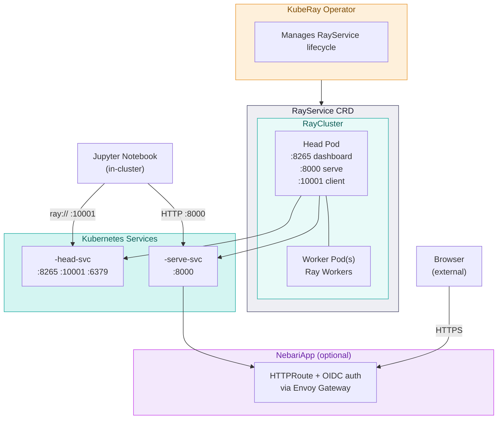

## The chain

**KubeRay operator** watches `RayService` resources. It creates the underlying
`RayCluster`, deploys the Serve applications named in `serveConfigV2`, monitors their
health, and performs zero-downtime upgrades when the config changes.

**RayService** is the chart's central object. It carries two things: the Serve config, and
the cluster config. The chart writes both from values — `serve.proxyLocation` and
`serveApplications` into `serveConfigV2`, and the head/worker specs into
`rayClusterConfig`.

**The head pod** runs the GCS (Ray's metadata store), the dashboard, the Serve controller,
and — with `proxyLocation: EveryNode` — an HTTP proxy. It exposes four ports: `6379` GCS,
`8265` dashboard, `10001` Ray client, `8000` Serve HTTP.

**Worker pods** run Ray workers, and Serve replicas land on them. One group,
`groupName: workers`, sized by `worker.replicas` between `minReplicas` and `maxReplicas`.

## Why the chart renders its own Services

RayService creates its own stable Services — but only after every Serve application reports
healthy. With the default empty `serveApplications` that condition never holds, so the
dashboard and Serve endpoint would be unreachable on a fresh install.

The chart therefore renders both itself, selecting the head pod directly:

```yaml
selector:
  ray.io/node-type: head
  app.kubernetes.io/name: kuberay
```

They exist from the moment the chart installs, regardless of Serve state. Both carry
`argocd.argoproj.io/compare-options: IgnoreExtraneous` so Argo CD tolerates the Services
KubeRay creates alongside them.

Note that `serve-svc` targets **only the head pod**, even under `proxyLocation: EveryNode`.
The per-node proxies serve direct-to-pod traffic; the Service does not load-balance across
them. This is also why worker readiness has no effect on user-visible HTTP routing — the
reason the chart can safely simplify the worker probes.

## Serve config

```yaml
serveConfigV2: |
  proxy_location: {{ serve.proxyLocation }}
  http_options:
    host: "0.0.0.0"
    port: 8000
  applications: [...]
```

`host: "0.0.0.0"` is set here so the proxy binds all interfaces from the start — without it
Serve binds loopback and nothing outside the pod can reach it. That is why there is no
manual `serve start` step anywhere in this pack.

## Two access paths, by design

| | In-cluster | External |
|---|---|---|
| Client | notebooks, other pods | browsers, API clients |
| Route | ClusterIP Service | `NebariApp` → HTTPRoute → Envoy |
| Auth | none | OIDC at the gateway, when enabled |
| Protocols | `ray://` and HTTP | HTTPS |

The split is not an oversight. The Ray client protocol cannot traverse an OIDC redirect, so
notebooks must reach the head service directly. Access control on that path is
NetworkPolicy, not identity — anything permitted to reach `:10001` can submit arbitrary
code to the Ray cluster, which is worth scoping deliberately.

## The two NebariApps

Serve and dashboard get separate resources with separate hostnames, because they are
separate audiences with different exposure appetites. The recommended posture keeps the
serve endpoint internal (`serve.enabled: false`) and exposes only the dashboard.

Both inherit the same `auth` and `gateway` settings — there is no per-endpoint override.

## Conditional injections

Two features render nothing at all when unused, so the output is byte-identical to a plain
install:

- **[CA bundle](/ca-bundle/)** — an initContainer, volumes, mounts, and four environment
  variables on both pod specs, only when `orgCABundle.configMapName` is set.
- **[GPU toleration](/scaling/#gpus)** — an `nvidia.com/gpu` toleration, only when that
  group's `resources` mention the GPU resource, and only when you have not defined one
  yourself.

Both live under `spec.rayClusterConfig`, which is what makes the Argo CD
`ignoreDifferences` rule on that path consequential rather than cosmetic. See
[Deploying on Nebari](/deployment/#why-ignoredifferences-is-there).

## What state lives where

| State | Where | Survives a cluster roll |
|---|---|---|
| Declarative Serve applications | `serveConfigV2` in the RayService | yes |
| Applications deployed via `serve.run()` | the running Ray cluster | no |
| Model code | the container image | yes |
| Anything written to a pod filesystem | the pod | no |

The chart provisions no persistent volumes. Anything that must survive belongs in the image
or in external storage.
